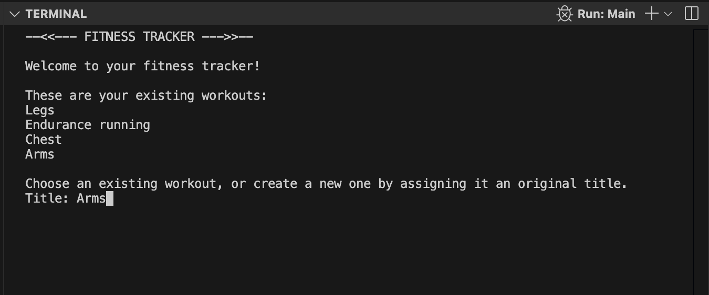
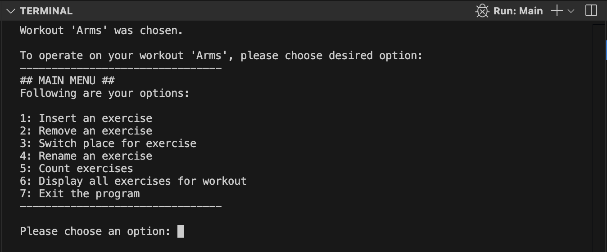

## Welcome to my fitness-tracker project!
This is a simple fitness tracking program in Java to manage workouts and associated exercises in the terminal, using the Java File class for data management.

1. Main view: For chosing/creating a workout
 

2. Workout view: For managing exercises for chosen/created workout
